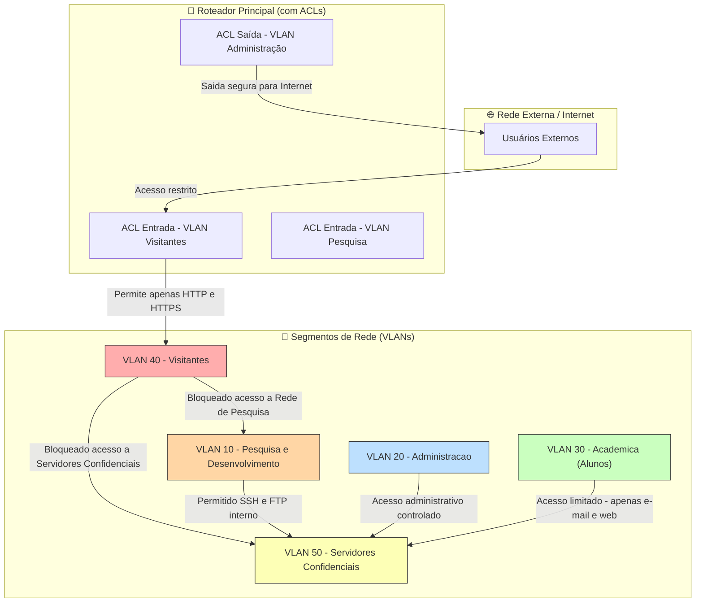
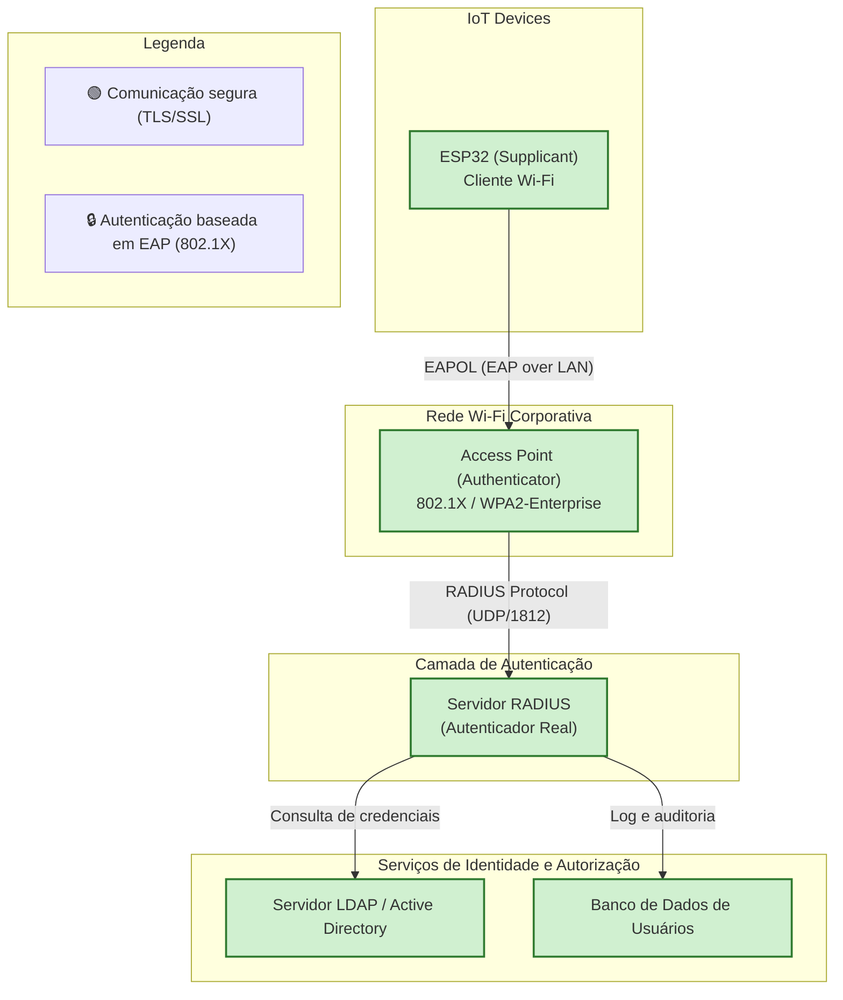
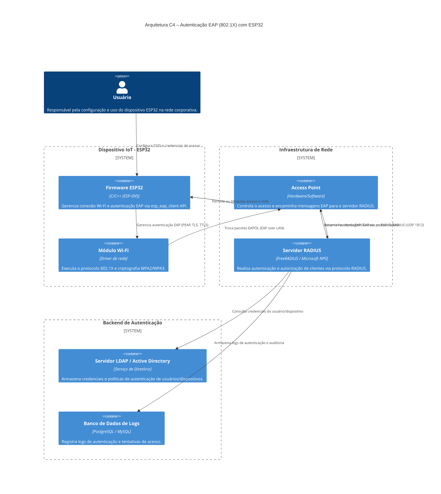

# 🔐 MBA em Cibersegurança — Notas de Estudo

Este repositório contém minhas **anotações, mapas mentais e resumos técnicos**
produzidos durante o **MBA em Cibersegurança**.

O objetivo é:
- Consolidar o aprendizado
- Facilitar revisões para provas
- Criar um material de referência profissional

---
## 📚 Conteúdo

- Fundamentos de Cibersegurança
- Redes de Computadores e Segurança
- Criptografia
- Segurança em Aplicações
- Governança, Risco e Compliance
- Ethical Hacking e Gestão de Vulnerabilidades

---

## 🧠 Metodologia de Estudo

- Resumos teóricos
- Mapas mentais (Mermaid)
- Questões comentadas
- Casos reais de incidentes
- Conexão com práticas de mercado

---

## ⚠️ Aviso

Este material é exclusivamente educacional e não deve ser utilizado
para fins ilegais ou não autorizados.

---

📌 *Repositório mantido como parte da evolução profissional em Cibersegurança.*

## Segmentação em VLANs e regras de acesso controladas


## Configuração de ACL Cisco (exemplo prático)

```bash
! ACL 100 - Controle de acesso para VLAN de Visitantes
ip access-list extended VISITANTES-ACL
  remark Bloqueia acesso a Pesquisa e Servidores
  deny ip 192.168.40.0 0.0.0.255 192.168.10.0 0.0.0.255
  deny ip 192.168.40.0 0.0.0.255 192.168.50.0 0.0.0.255
  remark Permite acesso à Internet (tráfego externo)
  permit ip 192.168.40.0 0.0.0.255 any
  remark Negar todo o resto por padrão
  deny ip any any log
exit

! Aplicando a ACL na interface VLAN dos Visitantes
interface GigabitEthernet0/4
 description Interface VLAN 40 - Visitantes
 ip address 192.168.40.1 255.255.255.0
 ip access-group VISITANTES-ACL in
 no shutdown
exit
```
## ESP32 implementado em uma rede Wi-Fi corporativa com autenticação EAP


### 🔒 Fluxo resumido da autenticação

1-ESP32 envia solicitação de conexão à rede Wi-Fi Enterprise.

 - O Access Point solicita as credenciais via EAP.

 - As credenciais são repassadas ao Servidor RADIUS via protocolo RADIUS.

 - O RADIUS consulta o LDAP/AD para verificar a validade do usuário.

 - Se aprovado, o RADIUS envia mensagem de sucesso (EAP-Success).

 - O ESP32 estabelece uma sessão segura e criptografada (WPA2/WPA3-Enterprise).

### Arquitetura C4 – Autenticação EAP (802.1X) com ESP32



### ⚙️ Fluxo de autenticação resumido

- O usuário configura o ESP32 com SSID e credenciais.

- O ESP32 Firmware inicia a conexão e executa o EAP Client.

- O Access Point recebe o pedido e envia o EAP-Request.

- O Servidor RADIUS valida as credenciais consultando o LDAP/AD.

- O resultado é logado e retornado ao ESP32, que ganha (ou não) acesso à rede.
