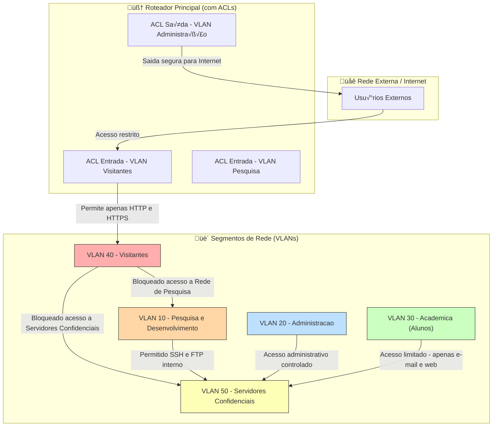

# mba-cybersecurity
Notas de aulas de projetos desenvolvidos.

## Segmentação em VLANs e regras de acesso controladas


## Configuração de ACL Cisco (exemplo prático)

```bash
! ACL 100 - Controle de acesso para VLAN de Visitantes
ip access-list extended VISITANTES-ACL
  remark Bloqueia acesso a Pesquisa e Servidores
  deny ip 192.168.40.0 0.0.0.255 192.168.10.0 0.0.0.255
  deny ip 192.168.40.0 0.0.0.255 192.168.50.0 0.0.0.255
  remark Permite acesso à Internet (tráfego externo)
  permit ip 192.168.40.0 0.0.0.255 any
  remark Negar todo o resto por padrão
  deny ip any any log
exit

! Aplicando a ACL na interface VLAN dos Visitantes
interface GigabitEthernet0/4
 description Interface VLAN 40 - Visitantes
 ip address 192.168.40.1 255.255.255.0
 ip access-group VISITANTES-ACL in
 no shutdown
exit
```
